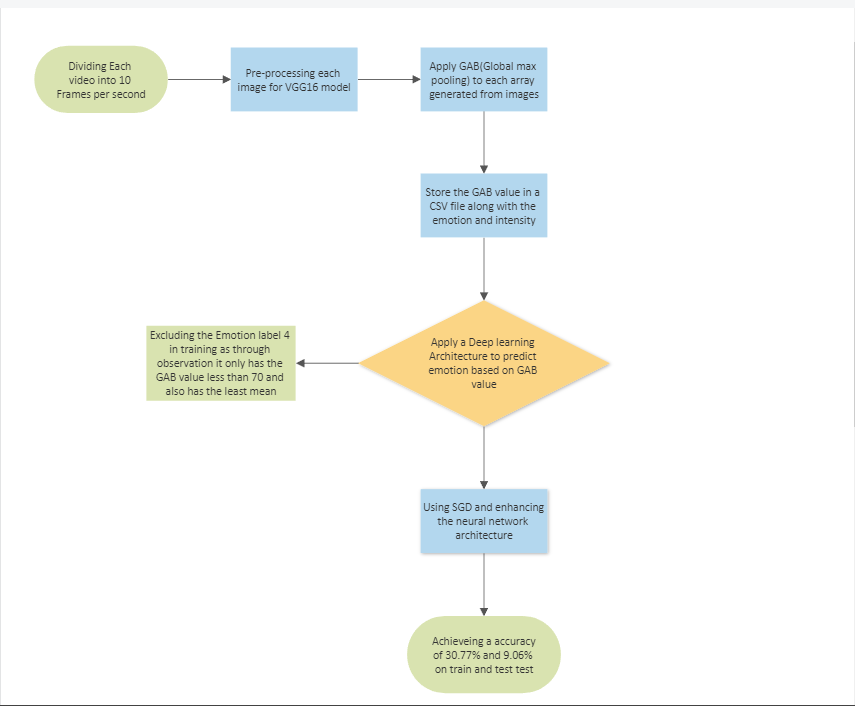

# Emotion-Classification

Emotion-Classification Project developed using the [RAVDESS](https://zenodo.org/record/1188976) dataset aims to recognize emotions from video and image data. The baseline technique employed in this project is based on the paper ["Video and Image-based Emotion Recognition Challenges in the Wild EmotiW."](https://dl.acm.org/doi/10.1145/2818346.2829994)Due to computational limitations, the desired model architecture was not feasible to implement.

Instead, an alternative approach was adopted, resulting in an accuracy of 30.77% on the training data and 9.06% on the testing data. Although the achieved accuracy may seem relatively low, it should be noted that emotion recognition from visual data is a challenging task with various factors influencing the results.

This project serves as a starting point for further exploration and improvement in emotion recognition. Future work can focus on developing more advanced and computationally efficient models, exploring different feature extraction techniques, or incorporating additional data augmentation methods to enhance the accuracy of emotion classification.

# Table of contents
- [Architecture](#architecture)
   - [Model build](#model-build)
   - [Desired Model](#desired-model)
- [Approach](#approach)
- [Approach If Had access to more RAM](#approach)
- [Scope of Improvement](#scope-of-improvement)
- [Technologies-used](#technologies-used)

# Architecture

[(Back to top)](#table-of-contents)

### Model build
[(Back to top)](#table-of-contents)

 - I have made two architectures. First one  what I have implmented fully and made the predictions. This models consist of pre-processing the data and training it on a neural network architecture. 

### Desired Model
[(Back to top)](#table-of-contents)

 - This architecture is what I desired to build. It consists of 2 architectures one for training the data and other for testing it.

 - This is the testing architecture

# Approach

[(Back to top)](#table-of-contents)

My approach was to pre-process the images first for that as you might have seen in the image I have divided them into frames and applied the `preprocess_input` function from vgg module to pre-process. I think that extracting information directly from a video is quite complex task and for humans we dont get much idea on how where the features extracted from the video came from. So extracting features from a image would be better in my opinion.

I have also divided the training data into 2 categories based on the gender. I think it differs a lot when it comes to emotions how men and women react to it so differentiating that would give us better results.

# Approach If Had access to more RAM

[(Back to top)](#table-of-contents)

Pre-processing is done as explained earlier.

Here, I have also divided the training data into 2 categories based on the gender. I think it differs a lot when it comes to emotions how men and women react to it so differentiating that would give us better results.

After that, I have applied the **VGG18** as my pre-trained model and then I have also made some top layers to fine-tune it according to our dataset. You can find the link to this model(which I wasn't able to run:(, due to huge computational cost) [here!](model_not_used.ipynb)

Now for testing, I will use the [deepFace](https://en.wikipedia.org/wiki/DeepFace) library to detect the gender, and after that I will be pre-process and running through the model.

Now If my video is divided into 50 frames, I will get 50 probabilistic outputs.

Here I have two options:-
  - Either take the sum of each emotion in each frame and declare the highest sum as the emotion detected
  - Chose an emotion(through the maximum probability) for each frame and declare the most occurring emotion as the detected one. If more than 1 emotion has the highest number of frames they have been chosen for, then for the tie-breaker go with which one has the highest sum among all frames.
  
P.S:- the [model_not_used.ipynb](model_not_used.ipynb) was supposed to be for male training set classification.

# Scope of Improvement

[(Back to top)](#table-of-contents)

The models performance can be improved through some of the ways listed below:-
 - I think [learning rate scheduler](https://towardsdatascience.com/learning-rate-schedules-and-adaptive-learning-rate-methods-for-deep-learning-2c8f433990d1#:~:text=Learning%20rate%20schedules%20seek%20to,step%20decay%20and%20exponential%20decay.) is one of the ways that can work. 
 - GridSearchCV can also help us a lot in finding the best attributes.
 - XGBoost and Kernel-SVM(again using GridSearchCV for finding the best kernel) can also yeild some good results.

# Technologies used

[(Back to top)](#table-of-contents)
 - Python
 - Numpy
 - Pandas
 - OpenCV
 - Matplotlib
 - Seaborn
 - Tensorflow keras
 - VGG16
 - os

 

